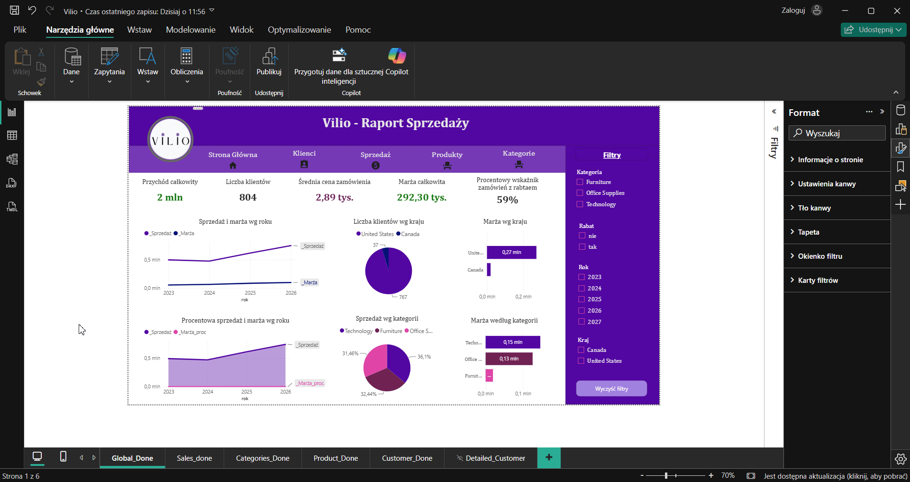

# 🟣 Vilio – Raport Sprzedaży - Analityka - ETL - Dashboard

  

Projekt Vilio to kompleksowy raport sprzedaży stworzony w Power BI, oparty na danych z anonimowego zbioru Superstore Sales Dataset z Kaggle: https://www.kaggle.com/datasets/himanshuuike/superstore-sales-dataset
Na potrzeby projektu dane zostały zanonimizowane i przekształcone w fikcyjną markę Vilio, z własnym logo i identyfikacją wizualną. Logo oraz nazwe wg mojego autorskiego projektu. 
Celem projektu było odwzorowanie pełnego procesu analitycznego w przedsiębiorstwie (ETL) – od czyszczenia danych, przez modelowanie, aż po wizualizację wyników.

Autor: Kamila Dudzińska

Obszar: Sales / Online Store

Technologie: Python, Pandas, SQL, Power Query, Power BI

Moduły: pandas, sqlite3, 

Źródło Kaggle: https://www.kaggle.com/datasets/himanshuuike/superstore-sales-dataset

📁 Jak uruchomić?

Otwórz plik .pbx aby zobaczyć efekt końcowy.

* Moduły zapisane jako skrypt Pythona (.py) lub SQL (.sql) należy uruchamiać w odp. IDE np. SQL Liste Studio lub Spyder/Pycharm. 

🗂️ Struktura projektu:

--> vs_dclean.py — skrypt do czyszczenia danych w Python/Pandas
Odpowiada za konwersję typów, usuwanie duplikatów i eksport oczyszczonych danych do pliku vilio_store_clean.csv.

--> vilo_con_sql.py — skrypt do eksportu danych do SQL
Ładuje dane z pliku CSV do bazy SQLite (vilo_store.db), odwzorowując proces ETL i przygotowując dane do modelowania w Power BI.

--> vilo_store.csv — surowy plik danych z Kaggle
Zawiera oryginalne dane sprzedażowe przed czyszczeniem i transformacją.

--> vilo_store_clean.csv — oczyszczony plik danych
Efekt działania skryptu vs_dclean.py, gotowy do załadowania do SQL lub Power BI.

--> vilo_store.db — baza danych SQLite
Zawiera podział na tabele faktów i wymiarów (Sales, Customer, Region, Product, Kalendarz), zgodnie ze schematem gwiazdy.

--> Vilo.pbix — raport Power BI
Końcowy dashboard wizualizujący dane sprzedażowe, marże, klientów i produkty w spójnym stylu UI/UX.

⚙️ Proces ETL (Extract – Transform – Load)

1. Czyszczenie danych w Python/Pandas. Skrypt vs_dclean.py przetwarza dane z pliku CSV.

* Wykonano konwersję typów, uzupełnienie braków, usunięcie duplikatów i eksport do vilio_store_clean.csv.

* Eksport do SQL

* Dane zostały zapisane w bazie vilo_store.db przy użyciu SQLite. Dlaczego SQL Studio? Nieestety z powodu nadgorliwości programu antywirusowego (Avast) całkowicie zblokował mi się Postgres. Reinstalacja, czyszczenie ukrytych plików, dodawnie wyjątków niestety nie podziałały. Musiałam sięgnąć po prostsze rozwiąznie bez łączenia z serwerem, a idealny w takiej sytuacji jest SQL Lite. 

* W Pythonie zastosowano funkcję load_to_sql() do automatycznego ładowania danych.

 
2. Modelowanie danych

* Dane podzielono na tabele faktów i wymiarów (SalesFact, DimRegion, DimCustomer, DimProduct).

* Zastosowano schemat gwiazdy (Star Schema) dla optymalizacji zapytań i wydajności.

3. Power Query

* Dodatkowe czyszczenie i transformacje: zmiana formatu dat, rozdzielanie kolumn, zamiana wartości.

Power Query pozwala na bezpieczną edycję zapytań bez ryzyka utraty danych.

4. Model danych 🧩

   
* Relacje 1 do wielu między tabelami faktów i wymiarów. Zachowana zalecana kardynalność i kierunek. 

* Tabela Kalendarz umożliwia analizę w czasie (Time Intelligence).

* Osobna tabela Miary zawiera wszystkie miary DAX, m.in.:

  * _%_wskaźnik_zamówień_z_rabatem

  *  _dynamiczna_liczba_nowych_klientów

  * _Marża_procentowa

  * _liczba_unikalnych_produktów

6.  Wizualizacje i UI/UX

   
* Spójny styl kolorystyczny (fiolet + róż + zieleń).

* Każda strona raportu zawiera:

* Główne wskaźniki KPI w postaci kart (zablokowane, niezmienne względem filtrów).

* Wykresy liniowe, słupkowe, pierścieniowe – czytelne i intuicyjne.

* Slicery po prawej stronie oraz przycisk „Wyczyść filtry” dla wygody użytkownika.

* Ikony i linki w górnym pasku ułatwiają nawigację między stronami raportu.

* Formatowanie warunkowe podkreśla pozytywne i negatywne wyniki.

7.  Lessons Learned 🧠

   
* Praca z ETL w Pythonie nauczyła mnie, jak ważna jest kontrola błędów i walidacja danych.

* Modelowanie danych w SQL pokazało, że dobrze zaprojektowane relacje znacząco przyspieszają analizę.

* Power BI wymaga dbałości o szczegóły w UI – nawet drobne elementy (kolor, ikonka, slicer) wpływają na odbiór raportu.

* Tworzenie własnej marki (logo, nazwa, styl) nadaje projektowi charakter i profesjonalizm.

8. Plany rozbudowy

   
* Dodanie strony „Podsumowanie” z kluczowymi KPI i trendami.

* Rozszerzenie kodu vs_dclean.py o obsługę błędów (try/except) i logowanie procesu.

* Wprowadzenie tooltipów w Power BI dla lepszej interakcji z użytkownikiem.

* Eksperyment z integracją danych w PostgreSQL po reinstalacji środowiska.

* Publikacja raportu w Power BI Service z możliwością filtrowania online.

Fragmenty kodu:

###  Kontakt:

